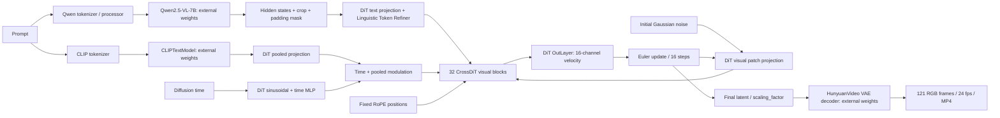

# KandinskyLab — учебные Jupyter-лабораторные по Kandinsky 5 Lite

Курс объясняет устройство Kandinsky от небольших опытов с тензорами до запуска **Kandinsky 5.0 T2V Lite distilled16steps 5s**. Основное оборудование: **Apple M3 Max, 40 GPU cores, 48 ГБ Unified Memory**. Второй маршрут — Google Colab с NVIDIA GPU. Объяснения и задания на русском.

Главная идея: сначала понять отдельную операцию, воспроизвести её маленьким кодом, посмотреть результат, затем найти ту же операцию в официальном исходнике. Маленькие сети курса показывают механику; настоящие pretrained-компоненты запускаются отдельными ячейками.

## Запуск в Google Colab

Кнопки открывают notebooks из main; после слияния PR они доступны напрямую. До слияния для проверки замените `/blob/main/` в Colab URL на `/blob/kandinsky-5-labs/`. Первая ячейка автоматически загружает код курса и устанавливает зависимости; архив вручную загружать не требуется. Тяжёлые веса и генерация включаются отдельными флагами.

| Лабораторная | Запуск |
|---|---|
| [00_start_and_training_map](notebooks/00_start_and_training_map.ipynb) | [](https://colab.research.google.com/github/vladislav-vasilenko/generative-ai-research/blob/main/kandinsky-5/notebooks/00_start_and_training_map.ipynb) |
| [01_text_embedders](notebooks/01_text_embedders.ipynb) | [](https://colab.research.google.com/github/vladislav-vasilenko/generative-ai-research/blob/main/kandinsky-5/notebooks/01_text_embedders.ipynb) |
| [02_vae](notebooks/02_vae.ipynb) | [](https://colab.research.google.com/github/vladislav-vasilenko/generative-ai-research/blob/main/kandinsky-5/notebooks/02_vae.ipynb) |
| [03_nn_building_blocks](notebooks/03_nn_building_blocks.ipynb) | [](https://colab.research.google.com/github/vladislav-vasilenko/generative-ai-research/blob/main/kandinsky-5/notebooks/03_nn_building_blocks.ipynb) |
| [04_attention](notebooks/04_attention.ipynb) | [](https://colab.research.google.com/github/vladislav-vasilenko/generative-ai-research/blob/main/kandinsky-5/notebooks/04_attention.ipynb) |
| [05_utils_and_nabla](notebooks/05_utils_and_nabla.ipynb) | [](https://colab.research.google.com/github/vladislav-vasilenko/generative-ai-research/blob/main/kandinsky-5/notebooks/05_utils_and_nabla.ipynb) |
| [06_dit_and_flow_matching](notebooks/06_dit_and_flow_matching.ipynb) | [](https://colab.research.google.com/github/vladislav-vasilenko/generative-ai-research/blob/main/kandinsky-5/notebooks/06_dit_and_flow_matching.ipynb) |
| [07_sampling](notebooks/07_sampling.ipynb) | [](https://colab.research.google.com/github/vladislav-vasilenko/generative-ai-research/blob/main/kandinsky-5/notebooks/07_sampling.ipynb) |
| [08_parallelize](notebooks/08_parallelize.ipynb) | [](https://colab.research.google.com/github/vladislav-vasilenko/generative-ai-research/blob/main/kandinsky-5/notebooks/08_parallelize.ipynb) |
| [09_local_m3_max](notebooks/09_local_m3_max.ipynb) | [](https://colab.research.google.com/github/vladislav-vasilenko/generative-ai-research/blob/main/kandinsky-5/notebooks/09_local_m3_max.ipynb) |
| [10_colab_cuda_distill](notebooks/10_colab_cuda_distill.ipynb) | [](https://colab.research.google.com/github/vladislav-vasilenko/generative-ai-research/blob/main/kandinsky-5/notebooks/10_colab_cuda_distill.ipynb) |
| [11_kvae_separate](notebooks/11_kvae_separate.ipynb) | [](https://colab.research.google.com/github/vladislav-vasilenko/generative-ai-research/blob/main/kandinsky-5/notebooks/11_kvae_separate.ipynb) |

Учебные лабораторные работают на CPU. Для полной генерации в лабораторной 10 нужен CUDA GPU с BF16 и достаточной RAM; рекомендуемый первый опыт — A100. Запуск pretrained-модели на NVIDIA ещё не проверен.

## Быстрый старт на Mac

Нужен **Python 3.11 или 3.12**, а не системный Python 3.14: для зафиксированного PyTorch 2.8 отсутствуют соответствующие Python 3.14 wheels. Из папки `kandinsky-5` после создания окружения запустите:

```bash
source .venv-labs/bin/activate
python -m jupyter lab notebooks
```

Для новой машины:

```bash
python3.12 -m venv .venv-labs
source .venv-labs/bin/activate
python -m pip install -r requirements-labs.txt
python -m jupyter lab notebooks
```

В Jupyter выберите kernel этого окружения. Чтобы добавить его в уже установленный Jupyter:

```bash
python -m ipykernel install --user --name kandinsky-labs --display-name "Python 3.12 (KandinskyLab)"
```

Открывайте `00_start_and_training_map.ipynb`, выполняйте ячейки сверху вниз. Все notebooks самостоятельны: не требуют переменных из предыдущего kernel. `LAB_DEVICE='cpu'` — базовый учебный режим. CPU выбран для воспроизводимости и небольших задач; notebook 09 отдельно проверяет MPS. Не включайте одновременно несколько тяжёлых notebook kernels.

## Дополнения по материалам MIT 6.S184

Лабораторные 02 и 06 используют предоставленные конспект и lab_one/lab_two/lab_three курса MIT (2026). В 02 добавлены Gaussian likelihood, joint KL и aggregate posterior, mutual information, spatial encoder, диагностика латентов и интерполяция. В 06 общие probability paths, continuity и score связываются с velocity и sampler Kandinsky. [Точная карта источников и исправления при адаптации](reference/course_materials/README.md).

## Учебный маршрут

| № | Notebook | Что научимся воспроизводить | Режим по умолчанию |
|---|---|---|---|
| 00 | [Start / training map](notebooks/00_start_and_training_map.ipynb) | Компоненты, frozen/trainable, память, размеры видео | CPU, без весов |
| 01 | [text_embedders.py](notebooks/01_text_embedders.ipynb) | Токенизация, lookup, Qwen hidden states, CLIP pooled, masks/crop | Малый опыт; настоящие tokenizer/encoder опционально |
| 02 | [vae.py](notebooks/02_vae.ipynb) | Causal Conv3d, posterior, mini-VAE training, scaling, Hunyuan reconstruction | CPU; Hunyuan weights опционально |
| 03 | [nn.py](notebooks/03_nn_building_blocks.ipynb) | Patch embedding, time/text projection, RoPE, modulation, attention/FFN, unpatchify | Уменьшенные настоящие классы |
| 04 | [attention.py](notebooks/04_attention.ipynb) | Ручной attention → SDPA, masks, query chunks, backend selection | CPU, без весов |
| 05 | [utils.py / NABLA](notebooks/05_utils_and_nabla.ipynb) | Частоты, freeze, перестановки, local patches, block selection | CPU; NABLA selector — учебная иллюстрация |
| 06 | [dit.py + Flow Matching](notebooks/06_dit_and_flow_matching.ipynb) | Forward/hooks настоящего tiny DiT, velocity loss и обучение | CPU, около 130 тыс. параметров |
| 07 | [Sampling](notebooks/07_sampling.ipynb) | Euler, schedule shift, CFG, NFE, контроль экспериментов | CPU, без весов |
| 08 | [parallelize.py](notebooks/08_parallelize.ipynb) | Математика column/row/sequence parallel, LoRA plan | CPU, виртуальные shards |
| 09 | [M3 Max inference](notebooks/09_local_m3_max.ipynb) | Последовательный experimental MPS путь до MP4 | Smoke tests; большие weights выключены |
| 10 | [Colab CUDA inference](notebooks/10_colab_cuda_distill.ipynb) | Официальный pipeline с distill checkpoint, offload и замерами | Подготовка; generation выключена |
| 11 | [KVAE отдельно](notebooks/11_kvae_separate.ipynb) | KVAE 2D/3D, reconstruction, streaming cache, latent compatibility | Без весов; pinned standalone KVAE modules |

Минимальный маршрут до понимания инференса: **00 → 01 → 02 → 03 → 04 → 06 → 07 → 09 или 10**. Файлы utils и parallelize изучайте затем для optimizations. KVAE — самостоятельное исследование visual tokenizer.

В каждой лабораторной есть цель, объяснение перед кодом, наблюдаемые формы/числа, связь с upstream и задания. Для самостоятельных опытов записывайте гипотезу, изменяйте один фактор, сохраняйте исходный результат.

## Google Colab

Архив [KandinskyLab-colab.zip](KandinskyLab-colab.zip) содержит notebooks, `labkit`, requirements и зафиксированные исходники; в нём **нет весов и virtualenv**.

1. Откройте [Google Colab](https://colab.research.google.com/), выберите Upload notebook и загрузите нужный `.ipynb` из `notebooks/`.
2. Через панель Files загрузите `KandinskyLab-colab.zip` в `/content`.
3. Добавьте перед первой ячейкой notebook следующую подготовку:

```python
from pathlib import Path
import zipfile
with zipfile.ZipFile('/content/KandinskyLab-colab.zip') as archive:
    archive.extractall('/content')
```

4. Для новой CPU-среды установите зависимости **до импортов**:

```python
%pip install -r /content/KandinskyLab/requirements-labs.txt
```

После смены версии PyTorch перезапустите runtime и затем выполняйте notebook. Colab использует собственную CUDA-среду: соответствие версий Torch/Torchvision обязательно. Для CPU-лаб GPU не требуется. Для notebook 10 выберите GPU runtime, установите дополнительные зависимости отдельной предусмотренной ячейкой.

Бесплатная GPU-сессия не гарантирует полный запуск. Официальный BF16 маршрут notebook 10 требует BF16-capable GPU; T4 не удовлетворяет этой проверке. На A100/L4 остаются ограничения VRAM, RAM и доступности runtime. Уроки 00–08 можно пройти независимо от этого. Шарды Qwen занимают существенную часть RAM при загрузке; CPU offload экономит VRAM, но не системную память.

Прямых `Open in Colab` badges нет, поскольку курс ещё не размещён в GitHub. Upload работает без публикации. Скачайте MP4, JSON и latent artifacts до завершения временной сессии.

## Официальный T2V example и выбор платформы

В Colab-лабу 10 добавлен разбор `examples/inference_examples_t2v.ipynb`; оригинал сохранён в reference/kandinsky-5/examples с тем же pinned commit. Нужная ячейка — Lite Distil 5s. Она использует get_video_pipeline, config k5_lite_t2v_5s_distil_sd.yaml и CUDA для всех компонентов. Это пример вызова готовой среды: установка и выборочная загрузка весов организованы в нашей лабораторной отдельно.

Для первого full-scale результата рекомендуется CUDA runtime: предпочтительно A100 с достаточной системной RAM. GPU и high-memory Colab доступны в зависимости от тарифа/ресурсов, не гарантированы. Исходный notebook на M3 Max без адаптации не работает из-за CUDA device setup, generator/autocast и VAE memory planner. Notebook 09 сохраняет экспериментальный Mac маршрут; tiny MPS проверен, полный pretrained запуск пока нет.

Сравнение originals/defaults в лабораторной фиксирует: seed случайный, expansion включён, scheduler scale default=10, offload выключен. Наш controlled baseline задаёт seed=42, expansion=False, scale=5, offload=True, SDPA. Для точного original comparison исследуйте scale=10 отдельно. Не запускайте все SFT/noCFG/Distil/Pro ячейки исходного notebook сразу.

## Что входит в архитектуру

Выбранная система — **latent Flow Matching с CrossDiT**, а не один checkpoint из 2B параметров. Encoder текста, tokenizer, VAE и sampler имеют разные роли.



Это карта T2V Lite distill. У image Lite другие размеры DiT и **FLUX VAE**, у I2V добавляется conditioning первого кадра, у I2I — source-image channels/mask и image-aware conditioning. Самостоятельный KVAE не входит в этот выбранный T2V checkpoint.

### Training map: какие веса учим и какие переиспользуем

Нужно различать **происхождение весов**, **наш учебный FM training contract**, **историческое обучение Kandinsky** и **режим инференса**. У всех моделей инференса optimizer отсутствует. `eval()` не равен `requires_grad_(False)`.

| Компонент | Источник / владелец | Роль | Учебное обучение DiT / обычная адаптация | Подтверждение и границы |
|---|---|---|---|---|
| Qwen2.5-VL-7B-Instruct | Qwen / Alibaba, [`Qwen/Qwen2.5-VL-7B-Instruct`](https://huggingface.co/Qwen/Qwen2.5-VL-7B-Instruct) | Последний hidden-state слой текста, ширина 3584 | **Frozen внешний encoder**; вычисляем conditioning без optimizer | В `text_embedders.py` вызывается `freeze`, forward идёт в `no_grad`. Это прямое доказательство inference freeze; полная историческая optimizer map всех этапов этим файлом не задаётся |
| Qwen processor/tokenizer | Тот же checkpoint | Chat/system template, IDs, padding, crop | Фиксированные словарь и правила; trainable параметров нет | `AutoProcessor.from_pretrained`, шаблоны и crop constants в коде |
| Qwen vision tower | Часть Qwen VL checkpoint | Image tokens для image editing / expansion с изображением | В T2V encode не участвует; целая модель всё равно загружается | В T2V `images=None`, `videos=None`, forward по `input_ids` |
| Qwen LM output head | Часть того же checkpoint | Генерация текста для optional prompt expansion | Frozen для generation; не производит visual velocity | `.generate()` отделён от extraction hidden states |
| CLIPTextModel ViT-L/14 | OpenAI, [`openai/clip-vit-large-patch14`](https://huggingface.co/openai/clip-vit-large-patch14) | `pooler_output` [B,768] | **Frozen внешний encoder** | Код загружает только text model, вызывает freeze/no_grad; CLIP image tower не требуется для T2V |
| CLIPTokenizer | OpenAI / тот же checkpoint | IDs длиной до 77 | Фиксированный tokenizer | `max_length=77`, truncation и special tokens |
| HunyuanVideo VAE encoder | HunyuanVideo / Tencent, [`hunyuanvideo-community/HunyuanVideo`](https://huggingface.co/hunyuanvideo-community/HunyuanVideo) | Video→16-channel latent; нужен для обучения/reconstruction/I2V | **Frozen внешний VAE** при обучении DiT; не входит в optimizer этого курса | Upstream downloader использует `vae/*` внешнего checkpoint. В отчёте обучения описано предварительное кодирование visual latents |
| HunyuanVideo VAE decoder | Тот же checkpoint | Latent→RGB video | Frozen; используется после sampling | `build_vae`, scaling и decode в generation_utils |
| FLUX.1-dev AutoencoderKL | Black Forest Labs, [`black-forest-labs/FLUX.1-dev`](https://huggingface.co/black-forest-labs/FLUX.1-dev) | Image latent codec для T2I/I2I Lite | Frozen внешний VAE в схеме обучения DiT | В `build_vae` выбирается name=flux; downloader сохраняет `flux/vae`. Может требоваться согласие на доступ к checkpoint |
| DiT visual/text/time/pooled projections | Kandinsky Lab | Приведение всех условий в model/time widths | **Trainable** при полном DiT training | Части одного `DiffusionTransformer3D` и одного DiT state_dict |
| Linguistic Token Refiner: text TransformerEncoderBlock | Kandinsky Lab | Уточнение frozen Qwen representations | **Trainable внутри DiT**, 2 блока в Lite | `text_transformer_blocks`; не перепутать с Qwen encoder |
| Visual TransformerDecoderBlock | Kandinsky Lab | Self-attention → cross-attention → FFN с modulation | **Trainable внутри DiT**, 32 Video / 50 Image | Все Q/K/V, output projections, norms, FFN и modulation входят в checkpoint |
| OutLayer / unpatchify projection | Kandinsky Lab | 16-channel velocity | **Trainable** | Нейросетевой слой + фиксированная перестановка осей |
| RoPE1D/3D и sinusoidal frequencies | Формулы в Kandinsky code | Текстовые/пространственно-временные позиции | Fixed buffers; не optimizer parameters | `register_buffer(..., persistent=False)` |
| SDPA / FlashAttention / Sage | PyTorch / внешние реализации attention | Вычислительный движок тех же Q/K/V | Нет отдельных обучаемых весов backend | Trainable Q/K/V находятся в DiT, не в attention.py |
| NABLA / STA mask construction | Kandinsky algorithms | Sparse routing для длинных видео | Функции отбора без отдельного trainable model | `utils.py`, `sparse_params`; выбранный 5s distill использует dense ветвь |
| Flow Matching path / loss | Математическая постановка | Учебная цель velocity MSE | Нет весов; **обучает DiT** через loss | Промышленный trainer не включён в данный inference repo; лабораторная 06 — прозрачная учебная реализация |
| Euler / scheduler shift / CFG | Алгоритмы sampling | Интегрирование velocity и смешивание predictions | Нет обучаемых весов | `generation_utils.py`, Δt<0, conditional/unconditional forwards |
| LoRA adapters | Kandinsky Lab camera LoRA / пользовательская адаптация | Изменение поведения поверх DiT | Для LoRA обычно учим A/B; base DiT frozen | В upstream есть adapter loading и parallelization plan; это отдельный вариант адаптации |
| KVAE-2D/3D | Kandinsky Lab, отдельный [`kvae`](https://github.com/kandinskylab/kvae) repo | Альтернативный visual codec | Если учим KVAE — trainable codec; если DiT поверх него — frozen codec | Не подставляется автоматически в уже обученный Hunyuan/FLUX latent contract; отдельная лабораторная 11 |

**Вывод для собственного обучения:** стандартный старт — оставить готовые text encoders и VAE frozen, учить Kandinsky DiT или его LoRA. Если меняете latent codec, нужно отдельно проверить совместимость распределений или переобучить/адаптировать DiT. Если учите VAE с нуля, это отдельная training задача с другим loss, а не часть velocity loss DiT.

**Исторические этапы:** технический отчёт описывает pretrain, SFT и video distillation; noCFG убирает второй forward, trajectory distillation сокращает число шагов. Teacher/discriminator относятся к обучению, а не к inference dependency. Для image RL reward-модель на базе Qwen обучается отдельно: это не тот frozen conditioning encoder. Полный optimizer contract каждого опубликованного checkpoint здесь не реконструируется без соответствующего trainer. [Технический отчёт, раздел 6](https://arxiv.org/html/2511.14993v1#S6).

```mermaid
flowchart TB
    V[Images / video] --> FV[Frozen external VAE encoder]
    FV --> X0[Data latent x0]
    P[Caption] --> FE[Frozen Qwen + CLIP]
    FE --> C[Conditioning]
    X0 --> MIX[xt = (1-t)x0 + t noise]
    N[Gaussian noise] --> MIX
    MIX --> D[Trainable DiT: projections + LTF + CrossDiT + OutLayer]
    C --> D
    T[Random t] --> D
    D --> LOSS[Velocity MSE against noise - x0]
    LOSS --> OPT[Optimizer updates DiT weights only]
    OPT --> D
```

Эта схема — явный contract учебной лабораторной 06. Производственная подготовка данных, full-scale distillation и reward training в курсе не запускаются.

## Архитектурный разбор каждого файла kandinsky/models

Не каждый `.py` — отдельная модель: `nn.py` содержит слои, `attention.py` — движки, `utils.py` — преобразования, `parallelize.py` — распределение вычислений. Отдельная лаба для каждого файла помогает видеть границы.

### text_embedders.py

| Объект | Что внутри / выход | Как воспроизводить |
|---|---|---|
| ClipTextEmbedder | CLIPTokenizer → CLIPTextModel → pooler_output [B,768] | Лаба 01, max_length=77, special tokens, frozen model |
| Qwen2_5_VLTextEmbedder | AutoProcessor + Qwen VL, system template, last hidden states, crop/mask/cu_seqlens | Лаба 01, настоящий tokenizer без weights; full encoder опционально |
| Kandinsky5TextEmbedder | Объединяет две ветви, возвращает dict + lengths/mask, `.to()` переносит оба encoder | Лаба 01; сохраняем tensors после последовательного encoding |
| get_text_embedder | Factory wrapper | Читаем входной YAML и создаём тот же набор условий |

В Video Lite Qwen `max_length=256` **после crop**; процессор получает 256+129 позиций. В Image Lite YAML стоит 512, хотя обзорная таблица отчёта указывает общий context=256: для запуска используем конкретный pinned YAML. Нельзя скрывать такие расхождения. В T2V encode upstream передаёт Qwen только input_ids, не attention_mask; в adapter сохранён этот выбор. Маска от processor используется downstream в DiT.

### nn.py

| Объект | Архитектура / назначение | Веса |
|---|---|---|
| TimeEmbeddings | Фиксированные frequencies → sin/cos → Linear → SiLU → Linear | Два Linear обучаемые |
| TextEmbeddings | Linear → LayerNorm | Обучаемые projection и norm |
| VisualEmbeddings | reshape/permute патчей 1×2×2 → Linear | Projection обучаемый |
| RoPE1D | Повороты пар координат для text positions | Fixed buffers |
| RoPE3D | Конкатенация временных/высотных/ширинных вращений | Fixed buffers; scale_factor |
| Modulation | SiLU → Linear → shift/scale/gate | Обучаемый Linear, zero init |
| MultiheadSelfAttentionEnc | Q/K/V projections, Q/K RMSNorm, text RoPE, padding-aware SDPA | Обучаемые projections/norms |
| MultiheadSelfAttentionDec | Q/K/V, RMSNorm, 3D RoPE; dense или NABLA | Обучаемые projections/norms |
| MultiheadCrossAttention | Q из visual, K/V из text, RMSNorm, mask | Обучаемые projections/norms |
| FeedForward | Linear без bias → GELU → Linear без bias | Обучаемые |
| OutLayer | Modulation → norm → Linear → unpatchify | Projection/modulation обучаемые |
| apply_scale_shift_norm | norm(x)·(1+scale)+shift | Функция использует переданные слои |
| apply_gate_sum | x+gate·out | Фиксированная формула |
| apply_rotary | Повороты 2×2, расчёт FP32 | Фиксированная формула |

Лаба 03 проверяет каждый класс на малых размерах, объясняя вход/выход. Видео Lite использует width=1792, head_dim=16+24+24=64 и 28 heads; FF width=7168. Time width=512. Model output — velocity, не RGB.

### dit.py

`TransformerEncoderBlock` обрабатывает текст: modulation → self-attention residual → FF residual. `TransformerDecoderBlock` выполняет три последовательных residual операции: visual self-attention, cross-attention к тексту, FFN. `DiffusionTransformer3D` содержит embeddings, 2 text blocks, 32 visual blocks, позиционные buffers и OutLayer. `get_dit` просто создаёт объект из config.

T2V config имеет `visual_cond=True`: вход DiT `[T,H_lat,W_lat,33]`, где 33=16+16+1. В T2V дополнительные conditioning channels/mask нулевые. После patching ширина входа Linear равна 132. Выход `[T,H_lat,W_lat,16]`. Image Lite имеет 50 visual blocks, width=2560, FF=10240; для I2I `instruct_type='channel'` добавляет source channels/mask.

Лаба 06 создаёт **те же официальные классы** на маленьких размерах и обучает velocity loss. Это не случайный учебный Transformer другой архитектуры; при этом tiny weights не pretrained и не должны генерировать осмысленное видео.

### attention.py

`SelfAttentionEngine` выбирает backend; `sdpa` преобразует `[B,L,heads,head_dim]` в `[B,heads,L,head_dim]`, вызывает PyTorch SDPA и возвращает прежний layout. `sage_attn` оборачивает Sage Attention. Imports FlashAttention 2/3/Sage опциональны. Auto предпочитает доступные быстрые implementations.

Лаба 04 воспроизводит `softmax(QKᵀ/√d)V`, masks и query chunking. FlashAttention ускоряет способ вычисления dense attention; NABLA меняет sparsity pattern. Это разные механизмы.

### utils.py

`exist`/`freeze`/`get_freqs` — простые helpers. `local_patching` и `local_merge` — обратные permutations. `fractal_flatten` и `fractal_unflatten` выбирают обычный flatten или grouped flatten; при sparse режиме применяют ту же перестановку к RoPE. `fast_sta_nabla` строит пространственно-временную local mask; `nablaT_v2` вычисляет адаптивную block mask для FlexAttention.

Лаба 05 проверяет обратимость permutations и объясняет CDF отбор на маленьких матрицах. Учебный block selector **не является полным NABLA kernel**. Нативный sparse 10s execution не портирован на MPS.

### parallelize.py

`parallelize_dit` задаёт DTensor plan для embeddings, attention projections, norms и FFN. `get_module_by_name` разрешает dotted path. `update_plan_for_lora` учитывает base_layer и адаптеры. `parallelize_seq` задаёт распределение visual/text sequence и module inputs/outputs.

Лаба 08 математически воспроизводит split/concatenate и split/sum на CPU и показывает ошибку локального attention без global K/V. Реальные collectives и multi-GPU не тестируются на однопроцессорном Mac/Colab. 40 GPU cores M3 Max — одно MPS устройство.

### vae.py

| Группа | Классы/функции | Архитектурная идея |
|---|---|---|
| Causal операции | HunyuanVideoCausalConv3d, prepare_causal_attention_mask | Только прошлые кадры; padding и causal attention |
| Изменение масштаба | HunyuanVideoUpsampleCausal3D, HunyuanVideoDownsampleCausal3D | Spatial/temporal compression, первый кадр обрабатывается отдельно |
| Residual / middle | HunyuanVideoResnetBlockCausal3D, HunyuanVideoMidBlock3D | Conv residual blocks, mid-level attention |
| Encoder stages | HunyuanVideoDownBlock3D, HunyuanVideoEncoder3D | RGB→posterior parameters |
| Decoder stages | HunyuanVideoUpBlock3D, HunyuanVideoDecoder3D | Latent→RGB |
| Model wrapper | AutoencoderKLHunyuanVideo | Posterior, encode/decode, tiling/slicing, reconstruction |
| Tiling helpers | tiled_encode/decode, temporal variants, blend_v/h/t, apply_tiling, get_enc/dec_optimal_tiling | Overlap, смешивание границ, memory planner |
| Factory | build_vae | Hunyuan video или FLUX image VAE |

Лаба 02 реализует causal convolution и posterior, обучает mini-VAE, затем отдельно выполняет Hunyuan reconstruction при включении флага. Большой VAE не обучается. CUDA-aware optimal tiling planner из upstream нельзя вызвать на Mac как есть.

## Углублённые лабораторные: VAE и Flow Matching

Лабораторная 02 расширена до 44 ячеек. Теория идёт от generative model и Bayes posterior к выводу ELBO через Jensen и двум разным KL. Exact Gaussian experiment проверяет, что ELBO — нижняя граница likelihood. Затем исследуем diagonal posterior, reparameterization и градиенты, связь reconstruction loss с observation model, β-VAE, posterior collapse и различие reconstruction/prior generation.

Практический разбор vae.py использует настоящие upstream Encoder3D/Decoder3D на уменьшенных размерах. Hooks показывают spatial/temporal stages, 2C posterior channels, quant_conv/post_quant_conv и контракт scaled latents с DiT. Отдельно обсуждаются границы causal convolution: нормализации и остальные слои требуют собственных проверок причинности. Исторический полный loss внешнего Hunyuan codec не выводится из inference файла.

Лабораторная 06 расширена до 38 ячеек. Она разделяет DiT architecture, Flow Matching training objective и ODE sampler. Рассматриваются conditional straight paths, marginal velocity как conditional expectation, пересечение training paths, convention data t=0/noise t=1, связь velocity/noise/clean prediction. Настоящий tiny DiT forward воспроизводится через отдельные stages с проверкой равенства. Дополнительный 2D conditional flow обучается на двух распределениях и генерирует из общего initial noise для разных conditions.

В конце теория соединяется с точными строками get_velocity/generate: t×1000, decreasing shifted schedule, отрицательный Δt, CFG и 16-step distilled weights. Учебный CFM loss не выдаётся за полный промышленный distillation trainer.

## Какие Lite checkpoints рассматриваем

Лимит **до 8B** здесь применяется к **Kandinsky backbone**, а не сумме всех моделей pipeline. Qwen 7B добавляется сверх Video DiT 2B или Image DiT 6B. Pro 19B исключён из маршрута.

| Семейство / вариант | DiT, примерно | Native HF suffix после `kandinskylab/` | Config / режим |
|---|---:|---|---|
| T2V pretrain 5s | 2B | Kandinsky-5.0-T2V-Lite-pretrain-5s | k5_lite_t2v_5s_pretrain_sd.yaml |
| T2V pretrain 10s | 2B | Kandinsky-5.0-T2V-Lite-pretrain-10s | k5_lite_t2v_10s_pretrain_sd.yaml; NABLA |
| T2V SFT 5s | 2B | Kandinsky-5.0-T2V-Lite-sft-5s | 50 steps, CFG → 100 NFE |
| T2V SFT 10s | 2B | Kandinsky-5.0-T2V-Lite-sft-10s | 50 steps, CFG; NABLA |
| T2V noCFG 5s | 2B | Kandinsky-5.0-T2V-Lite-nocfg-5s | 50 steps, guidance=1 → 50 NFE |
| T2V noCFG 10s | 2B | Kandinsky-5.0-T2V-Lite-nocfg-10s | 50 steps, guidance=1; NABLA |
| **T2V distill 5s** | **2B** | **Kandinsky-5.0-T2V-Lite-distilled16steps-5s** | **16 steps, guidance=1 → 16 NFE**, dense |
| T2V distill 10s | 2B | Kandinsky-5.0-T2V-Lite-distilled16steps-10s | 16 steps, guidance=1; NABLA |
| I2V Lite 5s | 2B | Kandinsky-5.0-I2V-Lite-5s | k5_lite_i2v_5s_sft_sd.yaml; image+text |
| T2I Lite | 6B | Kandinsky-5.0-T2I-Lite | k5_lite_t2i_sft_hd.yaml; FLUX VAE |
| T2I Lite pretrain | 6B | Kandinsky-5.0-T2I-Lite-pretrain | Отдельный checkpoint; dedicated YAML в repo отсутствует |
| I2I Lite | 6B | Kandinsky-5.0-I2I-Lite | k5_lite_i2i_sft_hd.yaml; source channels |
| I2I Lite pretrain | 6B | Kandinsky-5.0-I2I-Lite-pretrain | Отдельный checkpoint; dedicated YAML отсутствует |

Native и `*-Diffusers` — разные packaging/API; не подставляйте Diffusers transformer files в native `get_dit` без conversion. Для курса выбран **native** distill 5s с фиксированными версиями. Реестр [reference/hf-model-list.json](reference/hf-model-list.json) содержит снимок всех 71 HF repos организации на момент исследования: Lite/Diffusers, camera LoRA, Pro, KVAE, tiny modular pipelines и другие семейства. Полный список с clickable links в [MODEL_CATALOG.md](MODEL_CATALOG.md). WM/audio/Time-Adapter и Pro не входят в текущий учебный inference pipeline.

LoRA camera-control repos — дополнительные адаптеры, а не отдельные полные DiT backbone. Small/tiny названия сами по себе не подтверждают архитектурную эквивалентность selected Lite checkpoint.

## Практический договор выбранного distill 5s

| Параметр | Значение курса | Почему |
|---|---|---|
| DiT | distilled16steps_5s | Низкое NFE при исходной 2B архитектуре |
| steps / guidance | 16 / 1.0 | Одна conditional ветвь на шаг |
| scheduler_scale | **5.0 явно** | Значение distill YAML; upstream pipeline default=10, не оставляем неявным |
| FPS / latent frames | 24 / 31 для 5s | T2V pipeline formula |
| RGB frames | 121 | Causal temporal decode formula |
| H×W | 512×768 | Официальный SD resolution pair |
| latent channels | 16 | Hunyuan latent contract |
| DiT input channels | 33 | noisy + zero visual conditioning + mask |
| visual tokens | 47 616 | 31×32×48 после patching |
| Qwen / CLIP lengths | 256 / 77 | Specific pinned video config |
| prompt expansion | Выключен | Контролируемый точный prompt и меньшая latency |
| MagCache | Выключен | Baseline без дополнительного приближения |

Опубликованные latency относятся к H100, CUDA/PyTorch и прогретому запуску. Они не прогнозируют M3 Max/Colab. Distillation сокращает число вызовов DiT; shared encoders, VAE, размер весов и число visual tokens остаются. Поэтому нельзя утверждать, что distill автоматически имеет минимальную peak memory среди всех вариантов. [Официальная модель](https://huggingface.co/kandinskylab/Kandinsky-5.0-T2V-Lite-distilled16steps-5s).

### Почему официальный запуск нельзя просто переключить на mps

В pinned source есть `torch.cuda.set_device`, CUDA generator, CUDA autocast, CUDA memory planner, compile decorators и BF16 casts. Некоторые wrappers импортируют training/distributed/LoRA dependencies даже для обычного inference. В этой версии `kandinsky/__init__.py` экспортирует `get_video_pipeline`, а README upstream содержит старое имя `get_T2V_pipeline`: notebook 10 использует реальную factory.

`labkit/native.py` создаёт изолированный eager вариант настоящих DiT classes. Оригинальные файлы не меняются, глобальные torch functions не monkey-patchятся. Изменения: удаление compile/CUDA autocast decorators через AST, рабочий dtype, dense SDPA query chunks, padded text mask. `labkit/components.py` реализует последовательную загрузку external encoders, decreasing-time Euler, CPU RNG, checkpoint loading через meta и CPU FP32 VAE decoder из Diffusers.

Это **experimental Mac port**, не официальная MPS поддержка. Численная/побитовая эквивалентность CUDA не заявлена. Полный Mac запуск зависит от Metal operators, RAM и продолжительности decoding. CPU VAE decoder может работать очень долго. Не отключайте system memory watermark ради OOM.

### Как запускать большие эксперименты

В notebook 09/10 отдельно включаются download и generation flags. Загрузка ограничена выбранным DiT, Qwen, CLIP и VAE; `download_models.py` без аргументов не используется. HF revisions зафиксированы в `reference/hf-revisions.json`. Стандартный `HF_TOKEN` поддерживается Hugging Face Hub; секрет не вставляется в notebook и не печатается.

Mac stages: **Qwen → удалить → CLIP → удалить → DiT → удалить → VAE decode**. `.to('cpu')` на Mac переносит tensors между устройствами общего memory pool, а удаление модели освобождает её storage. Для 48 ГБ разумнее не держать Qwen/DiT/VAE одновременно. Полный FP32 Qwen значительно повышает память; основной порт BF16, проверка поддержки в notebook 09.

В `artifacts/` сохраняются `.conditioning.pt`, `.latents.pt`, `.mp4`, `.json`. Mac JSON содержит stage timings, source/model revisions, device/dtype/seed/steps/scale. CUDA notebook сохраняет elapsed и peak allocated VRAM. Для строгого latency сравнения добавьте warm run, отделите загрузку, сохранение и decoding; не принимайте total wall time за чистую latency DiT.

## KVAE: отдельная лабораторная и отдельная совместимость

В HF есть KVAE-2D-1.0, KVAE-3D-1.0, более новые 2.0 варианты и audio codec. Для лабораторной 11 выбраны **1.0**, где доступны отдельные cards/configs и API. Pinned KVAE source сохранён в reference/kvae; изолированный loader импортирует только video/image классы, без audio stack и CUDA/audio requirements всего репозитория. Учебная ячейка запускает уменьшенный настоящий KVAEVideo, затем отдельный флаг включает pretrained reconstruction. KVAEVideo работает с segmented temporal caches; независимые streams требуют независимых instances. `decode` KVAE возвращает tensor, тогда как Diffusers VAE возвращает объект с `.sample`.

Hunyuan и KVAE-3D-1.0 оба могут выдавать 16 каналов при 4×8×8 compression. Это совпадение форм, не координат и распределений латентного пространства. Исследовать KVAE можно через reconstruction; заменить им Hunyuan внутри готового T2V без адаптации DiT нельзя считать подтверждённым рабочим решением. [KVAE-3D-1.0 card](https://huggingface.co/kandinskylab/KVAE-3D-1.0), [KVAE-2D-1.0 card](https://huggingface.co/kandinskylab/KVAE-2D-1.0).

## Воспроизводимость и проверка

Официальный Kandinsky source зафиксирован на **`3a74261b957df0446c1969c5cedf8bbb07969ac2`**. Сохранены только код, configs, README и MIT license, без больших видео/истории. Reference files — данные для исследования и dependency tiny DiT; не редактируйте их, иначе source revision перестанет соответствовать содержимому.

Команды проверки:

```bash
python scripts/verify_notebooks.py
python scripts/check_native_port.py
```

`verify_notebooks.py` валидирует nbformat и выполняет notebooks с flags по умолчанию в свежем kernel каждого файла. Исполненные копии лежат в `reports/executed/`, сводка — `reports/notebook-validation.json`. `check_native_port.py` проверяет forward/training, dtype, strict checkpoint round-trip и chunked attention на уменьшенной модели. Отчёт статуса: [reports/VALIDATION.md](reports/VALIDATION.md).

**Отключённые pretrained ячейки, полный CUDA/MPS 5s inference, multi-GPU и reconstruction с настоящими KVAE weights требуют отдельного выполнения.** Отчёт явно различает проверенные учебные механизмы и непроверенные тяжёлые пути.

## Структура папки

```text
notebooks/                 12 последовательных учебных лабораторных
labkit/                    common helpers, eager DiT adapter, staged inference, KVAE loader
reference/kandinsky-5/     pinned официальный source + configs + license
reference/hf/             cards/configs/metadata без weights
reference/hf-revisions.json  pinned revisions selected dependencies
scripts/                   генерация и проверка курса
reports/                   отчёты; executed notebooks локально
artifacts/                 результаты экспериментов (не weights)
weights/                   появляется только при включении downloads
requirements-labs.txt      среда Python 3.11/3.12
```

## Источники

- [Kandinsky 5 GitHub](https://github.com/kandinskylab/kandinsky-5/tree/3a74261b957df0446c1969c5cedf8bbb07969ac2): основные архитектурные факты, configs и API.
- [Kandinsky 5 technical report](https://arxiv.org/html/2511.14993v1): история обучения и обзор архитектуры; это другой документ, чем NABLA paper.
- [Hugging Face model registry](https://huggingface.co/kandinskylab/models): доступные checkpoint families и упаковки.
- [NABLA paper](https://arxiv.org/abs/2507.13546): sparse attention, не основной Kandinsky 5 report.
- [Diffusers Kandinsky 5 documentation](https://huggingface.co/docs/diffusers/main/en/api/pipelines/kandinsky5): отдельный integration API; курс не смешивает его checkpoint packaging с native DiT.
- [KVAE GitHub](https://github.com/kandinskylab/kvae): standalone visual codecs.

Все оценки памяти по параметрам являются нижней оценкой хранения весов, не обещанием peak usage. Для оценки результата эксперимента нужны сохранённые версии, параметры и измерения на конкретной машине.

## Сторонние исходники

[Источники, лицензии и атрибуция](THIRD_PARTY.md). Веса моделей в курс не включены.

## Если Colab пишет Failed to fetch

Сообщение «Не удалось отправить сообщение в среду выполнения» с JavaScript stack trace возникает на этапе связи браузера с runtime. Оно само по себе не является Python traceback и не подтверждает ошибку ячейки установки.

1. В отдельной ячейке выполните `print(1 + 1)`. Если появляется та же ошибка, восстановите связь со средой прежде, чем запускать установку.
2. Переподключитесь к runtime и обновите страницу. Для лабораторной 00 достаточно CPU.
3. При необходимости выберите «Среда выполнения → Отключиться и удалить среду выполнения», затем подключитесь заново. Это удалит временные файлы и состояние runtime. Сначала сохраните нужные результаты.
4. Если ошибка остаётся, проверьте в другом браузере или сети; расширения, VPN и настройки браузера могут мешать соединению. Конкретную причину по одному stack trace определить нельзя.

[Официальный FAQ Colab: сброс нездоровой среды и подключение](https://research.google.com/colaboratory/faq.html). Подготовительная ячейка и полная генерация пока не проверены в настоящей сессии Colab.
